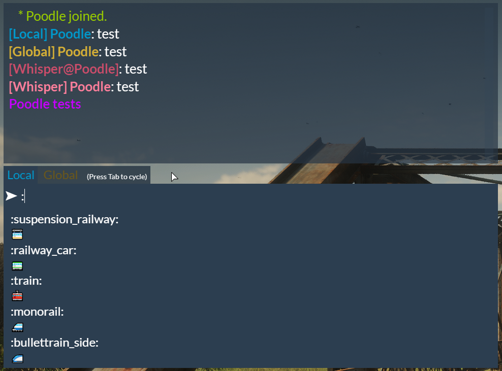

# PoodleChat



Chat resource used on the Poodle's Palace FiveM and RedM servers:
- [fivem.khzae.net](https://fivem.khzae.net)
- [redm.khzae.net](https://redm.khzae.net)

Based on the following resources:
- CitizenFX chat
- https://github.com/DevLanceGood/RPChat
- https://github.com/Tazi0/Server-Logging
- https://forum.cfx.re/t/release-emojis-for-chat-fivemojis-1-0/150713

# Features

- Text chat is proximity by default
- /global or /g to send a message to all players
- /whisper or /w to send a private message
- Optionally sends events and global messages to a Discord channel via a webhook
- Optionally displays messages from a Discord channel in-game
- Optionally send player reports to a Discord channel
- Configurable roles based on aces
- Configurable emoji shortcuts (`:heart:`, `:smile:`, and so on)

# Configuration

## General

The following variables in [config.lua](config.lua) control general settings for the chat:

| Variable                      | Description                                                           |
|-------------------------------|-----------------------------------------------------------------------|
| `Config.ActionColor`          | The colour for action messages (/me).                                 |
| `Config.DefaultLocalColor`    | The default colour for local messages.                                |
| `Config.DefaultGlobalColor`   | The default colour for global messages.                               |
| `Config.DiscordColor`         | The colour for messages from Discord.                                 |
| `Config.WhisperColor`         | The colour for received whisper messages.                             |
| `Config.WhisperEchoColor`     | The colour for sent whisper messages.                                 |
| `Config.ActionDistance`       | The distance between players at which actions will be visible.        |
| `Config.LocalMessageDistance` | The distance between players at which local messages will be visible. |

## Discord

The following variables in [config.lua](config.lua) control the Discord integration:

| Variable                              | Description                                                                          |
|---------------------------------------|--------------------------------------------------------------------------------------|
| `Config.DiscordWebhookId`             | The webhook ID to use to send messages to a channel.                                 |
| `Config.DiscordWebhookToken`          | The webhook token to use to send messages to a channel.                              |
| `Config.DiscordName`                  | The name to use when sending event messages (joins/disconnects).                     |
| `Config.DiscordAvatar`                | The avatar to use when sending event messages or if no avatar is found for a player. |
| `Config.DiscordBotToken`              | A Discord bot token to use in order to get messages and player avatars.              |
| `Config.DiscordChannel`               | A Discord channel to echo messages in-game from.                                     |
| `Config.DiscordReportChannel`         | A Discord channel to send player reports to.                                         |
| `Config.DiscordReportColor`           | Colour used for the report message embed on Discord.                                 |
| `Config.DiscordReportFeedbackMessage` | Message sent to players upoon submitting a report.                                   |
| `Config.DiscordReportFeedbackColor`   | Colour for the above feedback message.                                               |
| `Config.DiscordRateLimit`             | Time in milliseconds between any two Discord requests.                               |
| `Config.SteamKey`                     | A Steam key to use in order to retrieve avatars from Steam.                          |

All of these are optional, and can be left with their default value (empty string, `''`) to disable the Discord integration.

For *sending* in-game messages to Discord, at minimum `Config.DiscordWebhookId` and `Config.DiscordWebhookToken` must be set. For *receiving* messages from Discord and displaying them in-game, at minimum `Config.DiscordBotToken` and `Config.DiscordChannel` must be set. For sending player reports to Discord, at minimum `Config.DiscordBotToken` and `Config.DiscordReportChannel` must be set.

The ID and token of a Discord webhook can be found from the URL: `https://discord.com/api/webhooks/<id>/<token>`

## Roles

Roles are labels that appear next to a player's name in chat, such as "Admin" or "Moderator". Each role is associated with an ace, so that any players with that ace will receive that role. Optionally, each role can be given a colour that overrides the default local and global chat colours for names.

The list of available roles is configured in [config.lua](config.lua).

Example:

```
Config.Roles = {
    {name = 'Admin', ace = 'chat.admin'},
    {name = 'Moderator', color = {0, 255, 0}, ace = 'chat.moderator'}
}
```

In `server.cfg`:

```
add_ace group.admin chat.admin allow
add_ace group.moderator chat.moderator allow
```

## Emoji

Shortcuts for emoji can be configured in [emoji.lua](emoji.lua).

# Commands

```
/clear
```

Clears the chat window history.

```
/global [message]
/g [message]
```

Sends a message to all players in the server.

```
/me [action]
```

Sends a message to nearby players in the form of `[name] [action]`.

```
/reply [message]
/r [message]
```

Sends a message to the last player that sent you a private message (`/whisper`) or that you sent a private message to.

```
/say [message]
```

Sends a message to nearby players. The default text chat is also overridden to be proximity-based.

```
/togglechat
```

Toggles the chat window on/off.

```
/whisper [player] [message]
/w [player] [message]
```

Sends a private message to a player. `[player]` can be either an ID number or name.
